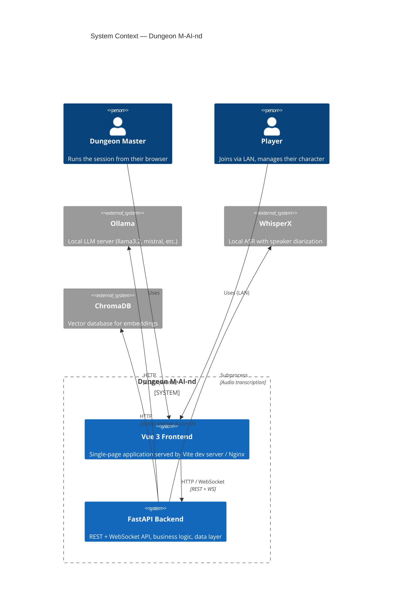
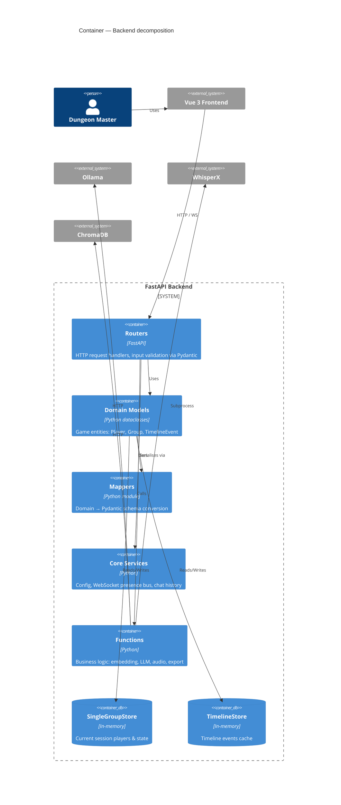
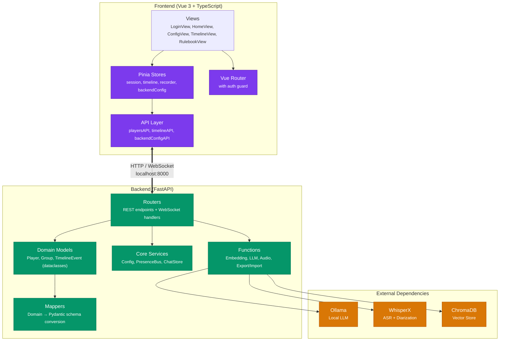
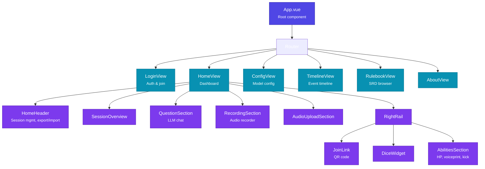

# Architecture

## System Context Diagram



## Container Diagram



## Layer Architecture



## Key Data Flows

=== "Transcription Pipeline"

    ```mermaid
    sequenceDiagram
      participant F as Frontend
      participant B as Backend
      participant W as WhisperX
      participant C as ChromaDB
      participant O as Ollama

      F->>B: Upload audio (WAV/WebM)
      B->>W: Transcribe + diarize
      W-->>B: Transcript with speaker labels
      B->>B: Match speakers to voiceprints
      B->>C: Store transcription embeddings
      B->>O: Extract timeline events
      O-->>B: Structured event data
      B->>F: Return transcription + events
    ```

=== "Q&A Pipeline"

    ```mermaid
    sequenceDiagram
      participant F as Frontend
      participant B as Backend
      participant C as ChromaDB
      participant O as Ollama

      F->>B: POST question
      B->>C: Semantic search (top-K)
      C-->>B: Relevant transcript excerpts
      B->>B: Build context + system prompt
      B->>O: Stream LLM inference
      O-->>F: Stream response (SSE)
      F->>F: Render markdown
    ```

=== "WebSocket Flow"

    ```mermaid
    sequenceDiagram
      participant P1 as Player 1 (DM)
      participant WS as Backend WS
      participant P2 as Player 2

      P1->>WS: Connect (player_id)
      Note over WS: Add to presence bus
      WS-->>P1: player_joined (self)
      WS-->>P2: player_joined (P1)
      P2->>WS: Connect (player_id)
      WS-->>P1: player_joined (P2)
      Note over P1,P2: Bidirectional state sync
      P1->>WS: update_player (hp, abilities)
      WS-->>P2: player_updated (P1)
      P1->>WS: disconnect
      WS-->>P2: player_left (P1)
    ```

## Component Tree (Frontend)



## Data Storage

| Store | Technology | Location | Contents | Persistence |
|-------|-----------|----------|----------|-------------|
| **Vector Store** | ChromaDB | `backend/data/chroma_db/` | Embeddings (transcriptions + rulebook) | Disk (SQLite + Parquet) |
| **Session Exports** | JSON files | `backend/data/SavedSessions/` | Player groups + config snapshots | Disk (manual save/load) |
| **Rulebook** | Markdown files | `backend/data/markdowns/` | D&D 5e SRD content | Disk (read-only) |
| **Player State** | In-memory dict | `SingleGroupStore` | Current session players | Memory (lost on restart) |
| **Timeline Events** | In-memory list | `TimelineStore` | Timeline events cache | Memory (lost on restart) |
| **Chat History** | In-memory dict | `ChatStore` | Per-player LLM chat history | Memory (lost on restart) |

## Architecture Decisions

| Decision | Rationale |
|----------|-----------|
| **In-memory stores** | Restart is rare; avoids DB ops for transient game state. Export/import provides persistence on demand. |
| **ChromaDB over PostgreSQL** | Full-text + vector search in one service. No schema migrations needed for unstructured session data. |
| **Ollama subprocess** | Runs alongside the app — no API keys, no cloud dependency, fully local. |
| **WhisperX subprocess** | Local ASR with speaker diarization; no audio data ever leaves the machine. |
| **Python/TypeScript split** | FastAPI for Python ML/AI ecosystem; Vue 3 for reactive, type-safe frontend DX. |
| **Mappers layer** | Decouples internal domain models from API contracts; enables schema evolution without touching business logic. |
