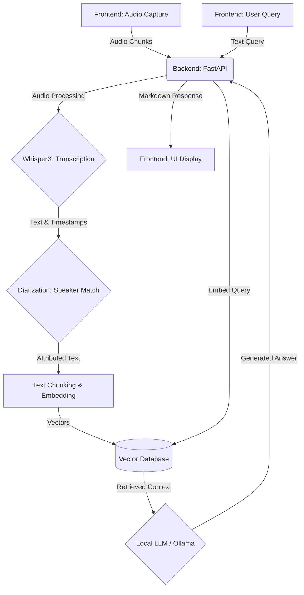

# Dungeon M-AI-nd: Technical Project Flow

This document details the end-to-end technical flow of **Dungeon M-AI-nd**, a locally hosted application designed to record, transcribe, and query Dungeons & Dragons (DnD) sessions using AI.

## High-Level Architecture Overview

The system is composed of three main components:
1.  **Frontend (Web Interface)**: Built with Vue.js/Vite (Node.js environment). Handles user interactions, audio capture (MediaRecorder API), player management, and displays the UI for Q&A.
2.  **Backend (API & Processing)**: Built with FastAPI (Python). Orchestrates the processing pipeline, handles transcription via WhisperX, manages the vector database for embeddings, and communicates with the LLM.
3.  **Local LLM (Inference)**: Powered by Ollama. Responsible for answering user queries based on the transcribed session context.

---

## Detailed Step-by-Step Flow

### 1. Session Initialization and Player Management
-   **Session Creation**: The Dungeon Master (Leader) starts a session via the frontend. The leader role is restricted to localhost to ensure control over the local processing pipeline.
-   **Joining**: Players can join via a local network connection (often facilitated by a QR code generated by the frontend).
-   **Voiceprint Registration**: Before the campaign starts, the frontend records a short audio clip for each player. This audio is sent to the backend to create a unique "voiceprint" embedding. These voiceprints are critical for accurate speaker diarization later on.

### 2. Audio Recording & Streaming (Frontend)
-   **Continuous Capture**: When "Start Recording" is clicked, the browser requests microphone permissions and uses the Web Audio API or `MediaRecorder` to capture the audio stream.
-   **Buffering & Chunking**: To handle long DnD sessions without running out of memory or losing data on crash, the frontend buffers the audio and periodically segments it into manageable chunks.
-   **Streaming to Backend**: These audio chunks are incrementally sent over HTTP/WebSockets to the FastAPI backend while the recording is still active.

### 3. Transcription and Diarization (Backend)
-   **Receiving Data**: The FastAPI backend receives the audio chunks.
-   **Preliminary Processing**: As chunks arrive, the backend begins preliminary processing.
-   **WhisperX Integration**: The backend leverages WhisperX (which relies on `ffmpeg` and GPU acceleration via CUDA) for Speech-to-Text. WhisperX is chosen for its high accuracy and fast alignment capabilities.
-   **Speaker Diarization**: Using the previously registered voiceprints, the backend attempts to match the spoken audio segments to specific players. This attributes the transcribed text to the correct character/player.
-   **Finalization**: When the recording is stopped, a final audio segment is sent. The backend completes the final transcription, alignment, and speaker labeling passes to create a cohesive transcript of the session.

### 4. Embedding and Vector Storage
-   **Text Chunking**: The finalized transcript is broken down into smaller semantic chunks (e.g., a few sentences or a specific dialogue exchange).
-   **Vectorization**: Each chunk is passed through an embedding model to create a high-dimensional vector representation.
-   **Vector Database**: These vectors, along with the original text and metadata (speaker, timestamp, session ID), are stored in a local vector database. This allows for fast semantic search (similarity search) rather than simple keyword matching.

### 5. Querying and Q&A (LLM Integration)
-   **User Prompt**: A player asks a question via the frontend (e.g., *"What did the NPC say before we left the city?"*).
-   **Query Vectorization**: The frontend sends the query to the backend, which embeds the question into a vector using the same embedding model.
-   **Semantic Search**: The backend queries the vector database for the most semantically similar transcript chunks (context retrieval).
-   **LLM Inference (Ollama)**: The retrieved context chunks and the user's original question are combined into a prompt. This prompt is sent to the local LLM running via Ollama.
-   **Response Generation**: The LLM generates a natural language response based *only* on the provided context (the real session dialogue).
-   **Rulebook Integration**: If the user enabled rulebook search, the backend may also perform a parallel search against a pre-indexed vector database of DnD rulebooks, appending those results to the response.
-   **Rendering**: The LLM's response is sent back to the frontend and rendered in Markdown for the user.

---

## Data Flow Diagram

## Setup and Technologies
*   **Python 3.12**: Core backend language.
*   **Node.js**: Frontend build tools.
*   **ffmpeg**: Required for WhisperX audio manipulation.
*   **CUDA/cuDNN/PyTorch**: Essential for hardware-accelerated transcription and LLM inference, ensuring the system runs in near real-time locally.
